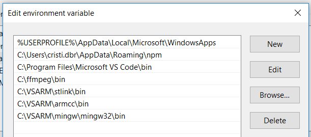
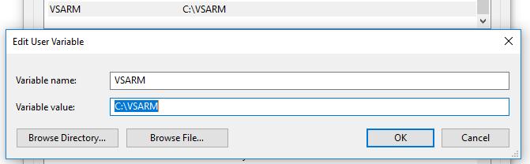

***1. Cài enviroment***
------------

- [GNU Embedded Toolchain for ARM](https://developer.arm.com/open-source/gnu-toolchain/gnu-rm/downloads) cài đặt vào ```C:\VSARM\armcc\```

- [ST-Link Tools](https://github.com/texane/stlink/releases) cài vào ```C:\VSARM\stlink\```

- [MinGW-W64](http://mingw-w64.org/doku.php/download) và cài tới ```C:\VSARM\mingw\``` 

- Cài PATH trong windown

    - tạo variable  tên VSARm với value C:/VSARM
    - Add đường dẫn vào Path.
    



***2. cài visualstdio***
----------

- https://marketplace.visualstudio.com/items?itemName=alefragnani.project-manager
- https://marketplace.visualstudio.com/items?itemName=ms-vscode.cpptools
- https://marketplace.visualstudio.com/items?itemName=marus25.cortex-debug

Nhần F1 và đánh vào ```>settings json``` chọn ```Open Setting json``` và điền
```"cortex-debug.armToolchainPath": "${env:VSARM}\\armcc\\bin\\```

***3. STM32 Workspace Setup***
---------

- Tạo Folder làm việc sau đó bấm ```F1``` đánh ```save workspace``` chọn ```Workspaces: Save Workspace As``` lưu tại thư mục chưa các projects.

- Nhấn F1 đánh ```save project``` lưu project với VD: template

- Nhấn F1 nhấn ```edit projects``` để sữa ```rootPath ``` tới thư mục con chưa project.

***4. STM32 Project Setup***
------------

- F1 -> edir config ->C/CPP: edit ...

```c
{
    "configurations": [
    {
    "name": "STM32 Debug",
    "includePath": [
        "${env:VSARM}/armcc/arm-none-eabi/include/c++/7.3.1",
        "${env:VSARM}/armcc/arm-none-eabi/include/c++/7.3.1/arm-none-eabi",
        "${env:VSARM}/armcc/arm-none-eabi/include/c++/7.3.1/backward",
        "${env:VSARM}/armcc/lib/gcc/arm-none-eabi/7.2.1/include",
        "${env:VSARM}/armcc/lib/gcc/arm-none-eabi/7.2.1/include-fixed",
        "${env:VSARM}/armcc/arm-none-eabi/include",
        "${workspaceRoot}/Drivers/CMSIS/Include/",
        "${workspaceRoot}/Drivers/CMSIS/Include/",
        "${workspaceRoot}/Drivers/CMSIS/Device/ST/STM32F3xx/Include/",
        "${workspaceRoot}/Core/Inc",
        "${workspaceRoot}/Core/Src",
        "${workspaceRoot}/Inc",
        "${workspaceRoot}/Src",
        "${workspaceRoot}/Drivers/STM32F3xx_HAL_Driver/Inc",
        "${workspaceRoot}/Drivers/STM32F3xx_HAL_Driver/Inc/Legacy/",
        "${workspaceRoot}/Drivers/STM32F3xx_HAL_Driver/Src"
    ],
    "defines": [
        "DEBUG",
        "DEFAULT_STACK_SIZE=2048",
        "HSE_VALUE=8000000",
        "OS_INCLUDE_STARTUP_INIT_MULTIPLE_RAM_SECTIONS",
        "PB_MSGID",
        "STM32F303",
        "STM32F303x8",
        "USE_DEVICE_MODE",
        "USE_FULL_ASSERT",
        "USE_HAL_DRIVER",
        "USE_USB_OTG_FS"
    ],
    "intelliSenseMode": "clang-x64",
    "browse": {
    "path": [
        "${workspaceRoot}",
        "${env:VSARM}/armcc"
    ],
    "limitSymbolsToIncludedHeaders": false,
    "databaseFilename": ""
    }
    }
    ],
    "version": 4
}
```

Cần chỉnh cho phù hợp với từng dòng chíp:
```
    - HSE frequency
    - Xóa USE_FULL_ASSERT
    - Thay thế DEBUG  bằng NDEBUG 
```


F1 -> config task ->Tasks: Configure tasks ->Create tasks.json file from template và chọn Other option

```c
{
    // See https://go.microsoft.com/fwlink/?LinkId=733558
    // for the documentation about the tasks.json format
    "version": "2.0.0",
    "tasks": [
        {
            "label": "Make Firmware",
            "type": "shell",
            "command": "mingw32-make -j8 all TARGET=vsarm_firmware OPT=\"-O2\" BINPATH=\"${env:VSARM}armcc\/bin\"",
            "options": {
                "cwd": "${workspaceRoot}"
            }, 
            "group": {
                "kind": "build",
                "isDefault": true
            },
            "problemMatcher": []
        },
        {
            "label": "Load Firmware",
            "type": "shell",
            "command": "st-flash write ./build/vsarm_firmware.bin 0x08000000",
            "options": {
                "cwd": "${workspaceRoot}"
            },
            "group": {
                "kind": "build",
                "isDefault": true
            },
            "problemMatcher": []
        }
    ]
}
```

Phần này sẽ tạo 2 task ( 1 để build,  2 là để flash)


***5. Launch configurations***
--------------

- F1->launch ->Debug: Open launch.json -> Cortex Debug và ghi file launch.json

```c
{
    // Use IntelliSense to learn about possible attributes.
    // Hover to view descriptions of existing attributes.
    // For more information, visit: https://go.microsoft.com/fwlink/?linkid=830387
    "version": "0.2.0",
    "configurations": [
    {
        "type": "cortex-debug",
        "request": "launch",
        "servertype": "stutil",
        "cwd": "${workspaceRoot}",
        "executable": "./build/vsarm_firmware.elf",
        "name": "Debug (ST-Util)",
        "device": "STM32F303K8",
        "v1": false,
        "svdFile": "${workspaceRoot}/STM32F303x.svd"
        }
    ]
}
```

- Phần này cần chỉnh tùy từng dòng chip.
Mỗi dòng sẽ cần file SVD riêng ta có thể [DownLoad](https://github.com/posborne/cmsis-svd/tree/master/data/STMicro) tại đây.
Sau khi download đúng chip coipy về bỏ vào thư mục project và edit lại ```sdvFile```

***6. CubeMX***
-----------

Tạo project và gen code, nhớ bỏ tick  ```Delete previously generated files when not re-generated``` trong Code Generator tab

***Gắn phím tắt để build và flash***
-------------


F1 ->keybindings  và 

```c
// Place your key bindings in this file to overwrite the defaults
[
    {
        "key": "f5",
        "command": "workbench.action.tasks.runTask",
        "args": "Make Firmware"
    },
    {
        "key": "f6",
        "command": "workbench.action.tasks.runTask",
        "args": "Load Firmware"
    }    

```
