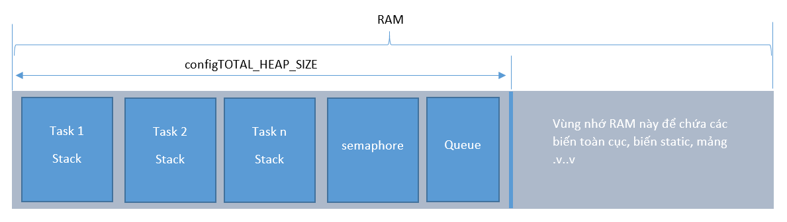

I. Bắt lỗi không đủ bộ nhớ Stack cho 1 Task nào đó
-----------------
Lỗi không đủ bộ nhớ Stack là 1 lỗi phổ thông trong RTOS vì đôi lúc mình không tính được tổng số biến mình dùng trong task nào đó chiếm bao nhiêu byte để mình cấp phát cho đúng lúc CreateTask. Do đó hệ thống RTOS cho phép tạo 1 hàm để bắt lỗi tràn stack (bộ nhớ stack bị tràn), để tạo hàm này bạn cần phải thay đổi 1 cái #define trong file ```FreeRTOSConfig.h``` là ```#define configCHECK_FOR_STACK_OVERFLOW 1```
Đặt giá trị 1 cho cái define bên trên để hệ thống có thể sử dụng hàm bắt lỗi tràn bộ nhớ stack. Khi đã define rồi thì bạn thêm hàm này vào 1 file bất kỳ trong project tùy bạn.
```
void vApplicationStackOverflowHook( xTaskHandle pxTask, signed char *pcTaskName )
 {
     printf("\r\nStack Overflow hook, source: %s", pcTaskName);
 }
```
 để sữa lỗi có 3 cách:

 1. tối ưu code.
 2. Chuyển local variable thành gloal variable, static variable ( biến này lưu độc lập ngoài vùng nhớ của RTOS )
 3. Cấp thêm bộ nhớ cho bộ nhớ heap của RTOS, bằng cách tăng giá trị configTOTAL_HEAP_SIZE trong file FreeRTOSConfig.h,

