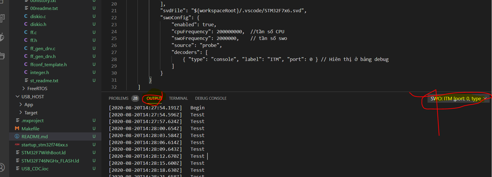

# **Debug SWO hay GBD trực tiếp trên visual stdio**

- Cài plugin hỗ trợ là ```cotex-debug```
- tạo thư mục lập trình và chỉnh sữa file ```launch.json```
- tải về file svd.

```c

        {
            "name": "(Windows) Launch",
            "type": "cortex-debug",                    // type
            "request": "launch",
            "cwd": "${workspaceFolder}",    
            "servertype": "openocd",                 // giao diện openocd
            "executable": "./build/USB_CDC.elf",     // file elf chạy
            "device": "STM32F746",
            "configFiles": [
                "interface/stlink-v2-1.cfg",  //interface của openocd
                "target/stm32f7x.cfg"
            ],
            "svdFile": "${workspaceRoot}/.vscode/STM32F7x6.svd",
            "swoConfig": {
                "enabled": true,
                "cpuFrequency": 200000000,  //tần số CPU
                "swoFrequency": 2000000,    // tần số swo
                "source": "probe",
                "decoders": [
                    { "type": "console", "label": "ITM", "port": 0 } // Hiên thị ở bảng debug
                ]
            }
        }
    ]
}
```



** Fix loi**
----------
