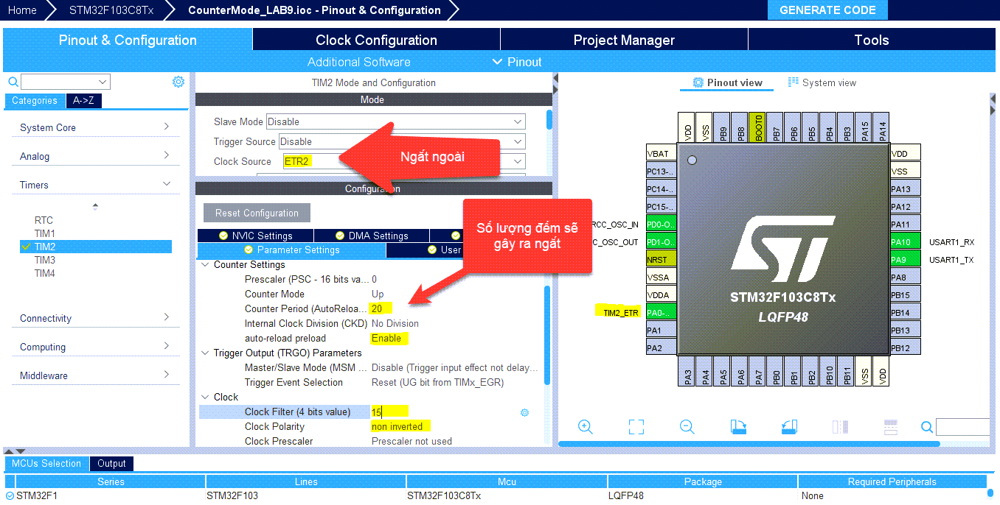

***# Cấu hình CubeMX.***
----------

Giống cấu hình với ngắt tràn timer.


***##2. mainCode***
-----

```c
#include "main.h"
TIM_HandleTypeDef htim2;
UART_HandleTypeDef huart1;
uint8_t END_MSG[35] = "Overflow Reached! Counter Reset!\n\r";
void SystemClock_Config(void);
static void MX_GPIO_Init(void);
static void MX_TIM2_Init(void);
static void MX_USART1_UART_Init(void);
int main(void)
{
    uint8_t MSG[20] = {'\0'};
    uint16_t CounterTicks = 0;
    HAL_Init();
    SystemClock_Config();
    MX_GPIO_Init();
    MX_TIM2_Init();
    MX_USART1_UART_Init();
    HAL_TIM_Base_Start_IT(&htim2); //enable timer
    while (1){
    	CounterTicks = TIM2->CNT; //read giá trị của bộ đếm
    	sprintf(MSG, "Ticks = %d\n\r", CounterTicks);
    	HAL_UART_Transmit(&huart1, MSG, sizeof(MSG), 100);
    	HAL_Delay(100);
    }
}
// Hàm sử lý ngắt khi bộ đếm đạt đến giá trị cài đặt.
void HAL_TIM_PeriodElapsedCallback(TIM_HandleTypeDef* htim)
{
    if(htim->Instance == TIM1 ){
	HAL_UART_Transmit(&huart1, END_MSG, sizeof(END_MSG), 100);
    }
}
```
